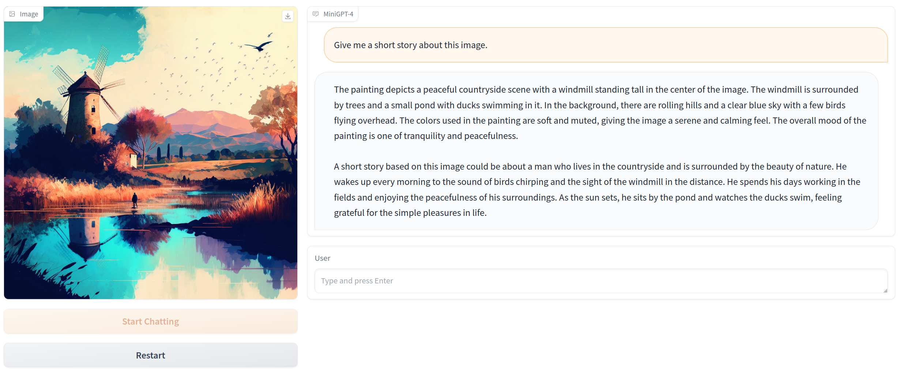
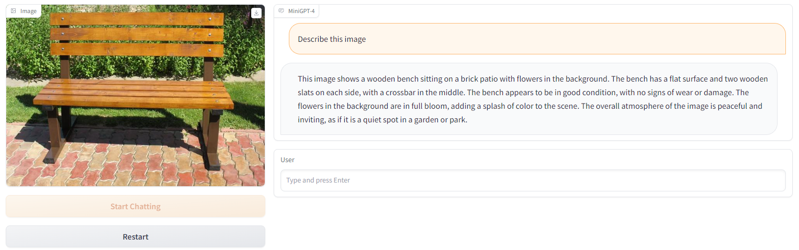
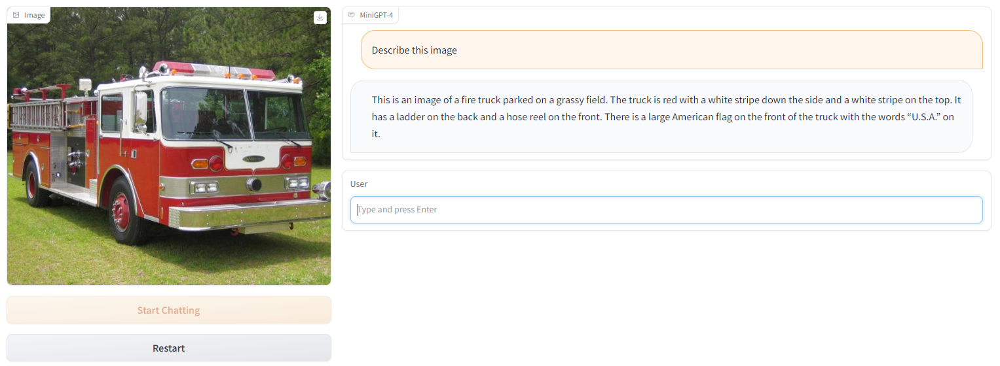

# MiniGPT-4-deploy
This repository provides a comprehensive description of the deployment of **MiniGPT-4**.

MiniGPT-4: Enhancing Vision-language Understanding with Advanced Large Language Models. Deyao Zhu*, Jun Chen*, Xiaoqian Shen, Xiang Li, and Mohamed Elhoseiny. *Equal Contribution. [[Paper]](https://arxiv.org/abs/2304.10592)[[Official Code]](https://github.com/Vision-CAIR/MiniGPT-4/tree/main)


## News

- 2023/06/13: We provide the deployment details of MiniGPT-4.

## Online Demo

[](https://minigpt-4.github.io)


## Get Started

### Prepare environment

**1. Git clone our repository**

```
git clone https://github.com/harrytea/MiniGPT-4-deploy.git
cd MiniGPT-4-deploy
```

**2. Install the environment**

This project uses python=3.10 and pytorch=2.0. Based on our experience, the following packages should be installed for inference.

```
# base
conda create -n python=3.10
conda install pytorch==2.0.0 torchvision==0.15.0 torchaudio==2.0.0 -c pytorch
pip install gradio
pip install omegaconf
pip install iopath
pip install timm
pip install opencv-python
pip install webdataset
pip install git+https://github.com/huggingface/transformers
pip install transformers
pip install decord

# inference
pip install sentencepiece
pip install accelerate
pip install bitsandbytes
pip install scipy

# prepare weight
pip install git+https://github.com/lm-sys/FastChat.git@v0.1.10
```

### Prepare weight

**1. Download vicuna, llama and MiniGPT-4 weight**

* Download vicuna weight from [huggingface](https://huggingface.co/lmsys/vicuna-13b-delta-v0), and download all files. We download `Vicuna_13b_delta_v0` and `Vicuna_13b_delta_v1.1`. Here, we use v0 by default.

* Download vicuna weight from [huggingface](https://huggingface.co/decapoda-research/llama-13b-hf), and download all files.

* Download vicuna weight from MiniGPT-4, there are two versions [13B](https://drive.google.com/file/d/1a4zLvaiDBr-36pasffmgpvH5P7CKmpze/view) and [7B](https://drive.google.com/file/d/1RY9jV0dyqLX-o38LrumkKRh6Jtaop58R/view), and download 13B.


**There is a misconception here, which is to convert the original pth file to huggingface format. We find that the weights downloaded from huggingface default to the huggingface format, so there is no need to convert them.**

If you need to convert the pth file to huggingface format, refer to the following steps

```
pth file
├── 13B
│   ├── =
│   ├── checklist.chk
│   ├── consolidated.00.pth
│   ├── consolidated.01.pth
│   └── params.json
├── tokenizer_checklist.chk
└── tokenizer.model
```

use this file [convert_llama_weights_to_hf.py](https://github.com/huggingface/transformers/blob/main/src/transformers/models/llama/convert_llama_weights_to_hf.py) and run the following command
```
python src/transformers/models/llama/convert_llama_weights_to_hf.py \
    --input_dir /path/to/downloaded/llama/weights --model_size 7B --output_dir /output/path
```

```
hugging format
├── 13B
│   ├── config.json
│   ├── generation_config.json
│   ├── pytorch_model-00000-of-00041.bin
│   └── ...
```

After preparing the two weights llama and vicuna, run the following command to obtain the final weights. The process takes ~60G memory

```
pip install git+https://github.com/huggingface/transformers@v0.1.10
python -m fastchat.model.apply_delta --base /data/wangyh/mllms/MiniGPT/weights/llama_13b --target /data/wangyh/mllms/MiniGPT/weights/vicuna_13b_working --delta /data/wangyh/mllms/MiniGPT/weights/vicuna_13b_delta_v0
```

The final weight file is as follows

```
weight
├── llama_13b
│   ├── ...
├── minigpt4
│   ├── 7b
│   └── 13b
├── vicuna_13b_delta_v0
│   ├── ...
├── vicuna_13b_working
│   ├── ...
```

### Launching Demo Locally

Run the following command, and the procedure occupy approximately ~18GB GPU memory






## Possible issues

**1. LlamaTokenizer requires the SentencePiece library but it was not found in your environment.**

`pip install sentencepiece`

**2. ImportError: Using `load_in_8bit=True` requires Accelerate: `pip install accelerate` and the latest version of bitsandbytes `pip install -i https://test.pypi.org/simple/ bitsandbytes` or pip install bitsandbytes`**

`pip install -i https://test.pypi.org/simple/ bitsandbytes` or `pip install bitsandbytes`

**3. AssertionError: Torch not compiled with CUDA enabled**

Running `conda list` command and file a pytorch-mutex package, run `conda uninstall pytorch-mutex` and re-install pytorch using the following command

```
# wrong
conda install pytorch==2.0.0 torchvision==0.15.0 torchaudio==2.0.0 -c pytorch 
# install slowly
pip install torch==2.0.0 torchvision==0.15.1 torchaudio==2.0.1
# work
pip install torch==2.0.0+cu118 torchvision==0.15.1+cu118 torchaudio==2.0.1 --index-url https://download.pytorch.org/whl/cu118

>>> import torch
>>> print(torch.__version__)
2.0.0+cu118
>>> print(torch.cuda.is_available())
True
```
